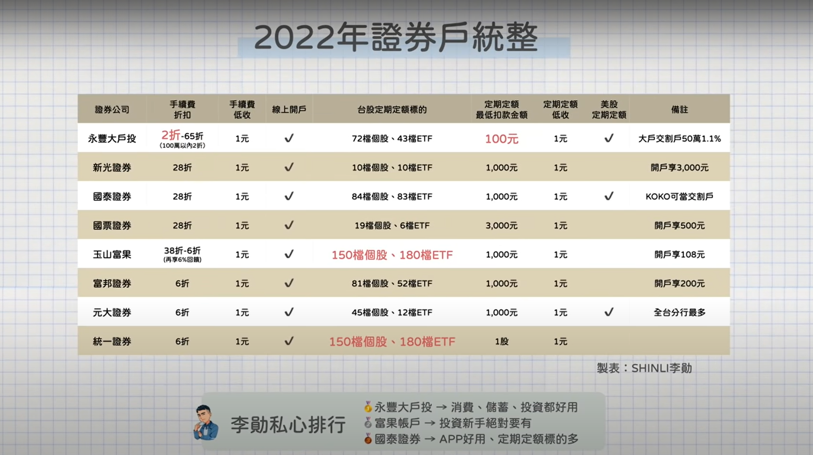

- 
-
- 申辦證券戶時需要考慮的幾個因素
	- 1.是否提供自己想要的投資服務
	  ・定期定額、美股投資
	  2.最低手續費與手續費折扣
	  ・基本手續費皆為0.1425%
	     。一張10萬元的股票，買進需負擔142.5元的手續費
	     。手續費再依照不同券商提供的折扣而有不同的費用
	  ・線上下單折扣約為2折-6.5折
	  🔺各家證券線上開戶享手續費折扣，詳細請洽相關單位
- 永豐大戶投｜https://pse.is/3yqhan (申辦再享100元)
	- 【單筆交易】
	  📌最低折扣 2折- 6.5折 
	  ・每月成交金額100萬以下享2折
	  ・活動至111/12/31
	  📌手續費最低1元 
	  📌可線上開戶：僅限永豐大戶數位帳戶
	  ・永豐大戶成為交割戶依然可享最高50萬內1.1%
	  【定期定額】
	  📌台股
	  ・72檔個股、43檔ETF
	  ・最低起扣金額100元 （目前最低）
	  ・手續費1元：扣款金額10,000以下
	  ・手續費1折：扣款金額10,000 - 100萬以下
	  ・手續費5折：扣款金額100萬以上
	  📌美股
	  ・買入手續費0.3%，無最低消門檻 (目前最低)
	  ・賣出手續費0.5%，低收35美金
	  ・提供定期定額、定期定股
	  🔺集結儲蓄、消費、投資的好選擇
	  🔺開戶再享100元7-11禮券
- 玉山富果帳戶｜https://shinli.pse.is/M4Q9V (註冊享108元)
	- 【單筆交易】
	  📌最低折扣 3.8折 
	  ・當月交易量在100萬以下：6折
	  ・當月交易量超過100萬到300萬：5折
	  ・當月交易量超過300萬：3.8折
	  🔺手續費再額外享6%富果幣回饋
	  📌手續費最低1元 
	  📌可線上開戶
	  ・開戶再送108枚富果幣
	  【定期定額】
	  📌台股
	  ・台灣50指數成分股、中型100指數成分股及非槓桿型且非反向型ETF商品
	  ・需透過玉山證券的股票e指存進行定期定額
	  ・最低起扣金額1,000元 
	  ・手續費1折：扣款金額20,000以下
	  🔺頁面簡單好用，適合投資新手，推薦樂活五線譜、ETF組成
- 國泰證券｜http://go.shinli.me/438dg9 (定期定額存股推薦)
	- 【單筆交易】
	  📌最低折扣 2.8折 
	  📌手續費最低1元 
	  📌可線上開戶 
	  ・可利用KOKO當交割戶
	  【定期定額】
	  📌台股
	  ・84檔個股、83檔ETF
	  ・最低起扣金額1,000元
	  ・手續費1元：扣款金額10,000以下
	  。活動至111/12/31
	  📌美股
	  ・買入手續費0.3%，低收4美金
	  ・賣出手續費0.35%，低收29美金
	  🔺定期定額ETF股票較多，APP推薦
- 統一證券
	- 📌最低折扣 6折 
	  📌手續費最低1元 
	  📌可線上開戶
	  【定期定股】
	  📌台股
	  ・台灣50成分股、台灣中型100成分股、ETF不含槓桿反向
	  ・最低購買股數1股
	  ・手續費1元
- 新光證券
	- 📌最低折扣 2.8折
	  📌手續費最低1元 
	  📌可線上開戶
	  ・限新光銀行、瑞星銀行帳戶，他行需臨櫃
	  ・開戶再送3,000元抵用金
	  ・ 開戶完成後，將姓名、身分證、電話寄信至 yali@skis.com.tw 並註明「SHINLI推薦」，即可享有抵用金
	  【定期定額】
	  📌台股
	  ・20檔個股、20檔ETF
	  ・最低起扣金額1,000元 
	  ・手續費1元：扣款金額20,000以下
- 元大證券
	- 【單筆交易】
	  📌最低折扣6折 
	  📌手續費最低1元 
	  📌可線上開戶
	  ❗️全台分行最多的券商
	  【定期定額】
	  📌台股
	  ・45檔個股、12檔ETF
	  ・最低起扣金額1,000元
	  ・最低手續費1元
	  📌美股
	  ·最低起扣金額100美金或3,000台幣
	  ・買入手續費0.3% + 轉換費20美金
	  ・賣出手續費同一般複委託手續費
- 富邦證券
	- 【單筆交易】
	  📌最低折扣6折 
	  📌手續費最低1元 
	  📌可線上開戶
	  ・開戶享200元7-11禮券
	  【定期定額】
	  📌台股
	  ・81檔個股、52檔ETF
	  ・最低起扣金額1,000元 
	  ・最低手續費1元
- 國票證券
	- 【單筆交易】
	  📌最低折扣2.8折 
	  📌手續費最低1元 
	  📌可線上開戶
	  ・任何一家銀行皆可開戶
	  ・開戶再享500元手續費折抵金
	  【定期定額】
	  📌台股
	  ・19檔個股、6檔ETF
	  ・最低起扣金額3,000元 
	  ・最低手續費1元
- 定期定額為什麼扣款金額不同？
  豐存台股以「張」為單位買入股票，再分配給所有的客戶，難免有分配不足的情況，豐存台股會盡可能買入您申購金額內最多的股數
  ● 系統分配原則：定股→依比例分配給定額→依成交價金大至小一股一股分配給定額
  ● 實際成交金額：股數*成交均價(小數點第三位無條件捨去)+尾差→實際成交價金可能與計算結果有1至3元不等的差距
- 2022基金平台推薦
  投資基金建議在基金平台購買，可節省較多交易成本(手續費、信託管理費)
- 鉅亨買基金｜https://pse.is/3g3g6e (輸入 shinli申購26萬元以內基金0手續費)
	- 📌基金數近4,000檔
	  📌手續費
	  ・股票型基金：定期定額0.3%、單筆0.3%
	  ・平衡型、債券型基金：0%
	  📌手續費優惠
	  ・開戶享終身定期定額0手續費3筆
	  ・2/28前加送單筆0手續費券5筆
	  ・1,400檔基金10年0手續費
	   。活動至111/3/31
	  ・零信託管理費
	  🔺輸入 shinli申購26萬元以內基金0手續費
	  📌最低起扣金額3,000元 
	  🔺擁有獨立投資APP，投資更方便
	  ❗️基金新手首選
- 基富通｜http://go.shinli.me/3vuxre (推薦碼YXAH0382，終生零手續費酷碰券)
	- 📌基金數3,000多檔
	  📌手續費
	  ・股票、平衡型基金：3%(打1.99折)
	  ・債券型基金：1.5%～2%(打2.99折)
	  📌手續費優惠
	  ・透過推薦碼註冊享定期定額終身零手續費優惠券
	  ・零信託管理費
	  📌好好退休平台
	  ・終身零手續費
	  ・專案獨享經理費≤ 1%
	  🔺連續扣款24期全平台基金終身零手續費
	  📌最低起扣金額3,000元
- ## Reference
	- [(417) 2022證券戶推薦！股票/ETF定期定額最低100元！終身零手續費！美股也能定期定額！存股推薦！新手激推3大券商！基金平台推薦！｜大戶投/國泰證券/富果帳戶/鉅亨/基富通｜SHIN LI 李勛 - YouTube](https://www.youtube.com/watch?v=5G2nEXZalZ0&ab_channel=SHINLI)