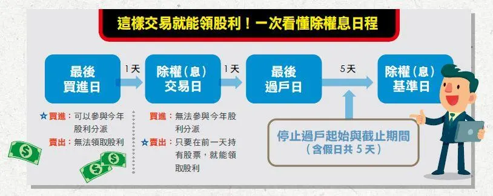

- ## Introduction
	- 
	- 日期
		- 最後買進日 T+0 這天買可以參與除權息
		- 除權息交易日 T+1  這天買無法參與除權息 (買股票者關注這天就好)
		- 最後過戶日 T+2 最後買進日的股票在 T+2 日交割
		- 停止過戶起始與截止期間
		- 除權息基準日 T+2+5
		- 發放股利日
	- 除權息參考價
		- 除權（息）參考價則為：（除權除息前一日收盤價－現金股利）÷（1+股票股利÷10）
		-
- ## 例子
	- 3005 神基
		- [(3005) 神基 除權除息日程一覽表 - Goodinfo!台灣股市資訊網](https://goodinfo.tw/tw/StockDividendSchedule.asp?STOCK_ID=3005)
-
- ## Reference
	- [iFortune—理財規劃](http://www.i-fortune.com.tw/myplan/plan-lesson-college-stock.aspx?cont=c&type=6)
	- [神基訂3/25為除息交易日，現金股利預定4/27發放 | 玉山證券. E.SUN Securities](https://m.esunsec.com.tw/news/instant-detail.aspx?id=%7B7A70B84F-0753-4A0D-941B-3F4CD16223C6%7D)
	- [何時買股票，才能配股配息呢？｜法白商感情 | 法律白話文運動](https://plainlaw.me/2021/07/04/plainlaw-15/)
	- [除息交易日、基準日、最後過戶日差在哪？ @ 元大期貨營業員曾鈺茹 :: 痞客邦 ::](https://knight2648531.pixnet.net/blog/post/335220023-%E9%99%A4%E6%81%AF%E4%BA%A4%E6%98%93%E6%97%A5%E3%80%81%E5%9F%BA%E6%BA%96%E6%97%A5%E3%80%81%E6%9C%80%E5%BE%8C%E9%81%8E%E6%88%B6%E6%97%A5%E5%B7%AE%E5%9C%A8%E5%93%AA%EF%BC%9F)
	- [(425) 除息交易日 基準日 最後過戶日？一堆日到底什麼意思？ | 夯翻鼠 FQ&A1 股票投資 - YouTube](https://www.youtube.com/watch?v=w5Lrg7W7jvk&ab_channel=%E6%9F%B4%E9%BC%A0%E5%85%84%E5%BC%9FZRBros)
	- [(425) 除息日怎麼沒扣股價？有一個很少被注意的除息參考價 | 夯翻鼠 FQ&A3 股票投資 - YouTube](https://www.youtube.com/watch?v=zMlhaNsnkW8&ab_channel=%E6%9F%B4%E9%BC%A0%E5%85%84%E5%BC%9FZRBros)